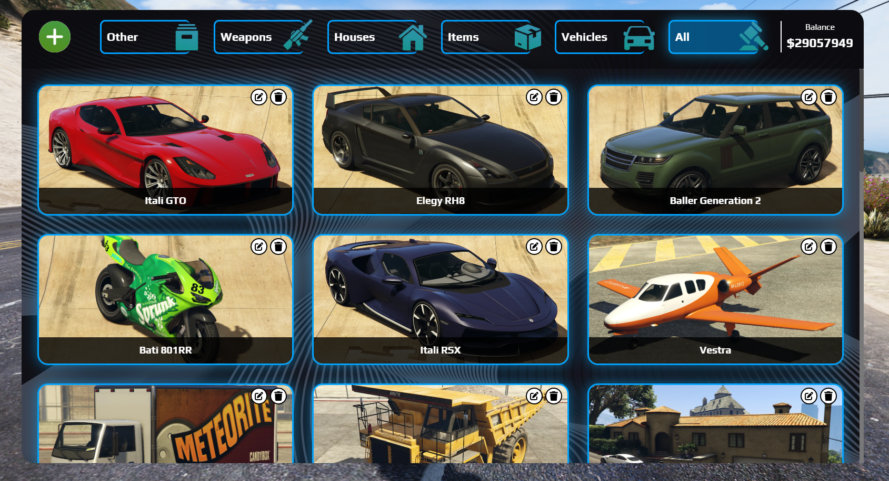

# FiveM Advanced Auction System
## Preview

<iframe width="1280" height="720"  src="https://www.youtube.com/embed/nbxyLw7kObE" title="HG Auction" frameborder="0" allow="picture-in-picture;" allowfullscreen></iframe>

## Description
Elevate your FiveM server's auction experience with HG-Auction. Featuring a real-time bidding system synced with server time, this script ensures seamless and secure auctions. With a user-friendly interface, comprehensive logging, and robust security, it's a reliable choice. The standout feature is the automatic prize system, streamlining and enhancing overall efficiency. HG-Auction – the ultimate FiveM auction script. 
## Features
### Framework support:

- New/Old ESX
- New/Old QBCore
### Real time bidding
Our script provides real time updates on all the auctions. This allows players to do bidding wars without having to refresh the interface every few seconds.

### Server side time sync
Our server time syncing system ensures that all players have equal bidding odds. The system makes sure that all players have the exact same time no matter their region / computer clock / ping.

### Security Measures
Besides the Server-Sider time sync feature, our script provides a time extension system which extends the bidding time by a configurable amount when someone bets before the auction ends. This makes sure that any last-second desync issues don't occur. We have tested this in a server with 100+ concurrent players. This option is configurable and can be disabled in the config.

### Private Auctions
When adding an auction, you can set it to private, meaning it will only show up for players with certain jobs (Configurable). This can be useful if you want to auction off police vehicles and work vehicles.

## User Interface
### Main interface
Player View:

- Black money auctions have a red money bag icon on them. These can only be bid on with black/dirty money 

Auction Manager View:

- The auction manager has extra buttons that allow him to add/edit/delete auctions 

Add/Edit modal:

- Each category has its own fields. You can change the name of these fields and you can change their function in the automated rewarding system

Place bid modal:

### Themes
We provide 4 predefined themes you can pick from. You can add your own by editing the CSS file. Read more [here](configuration.md#customization)

Default:

Ocean:

Purple:

Space:

### Discord logs
The discord webhook sends an embeded message on discord when an auction is added/when an auction ends

