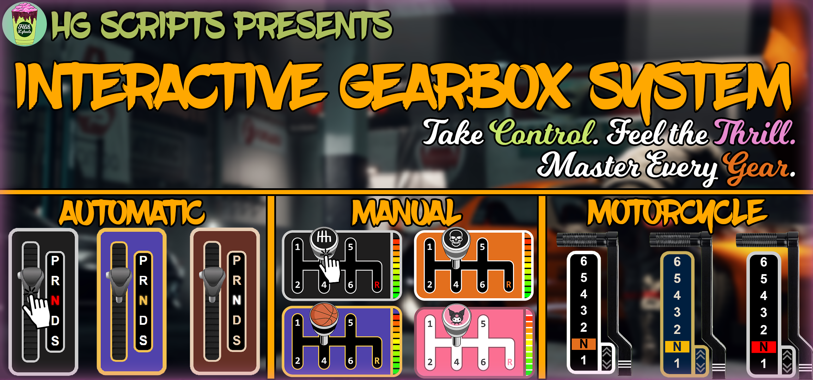
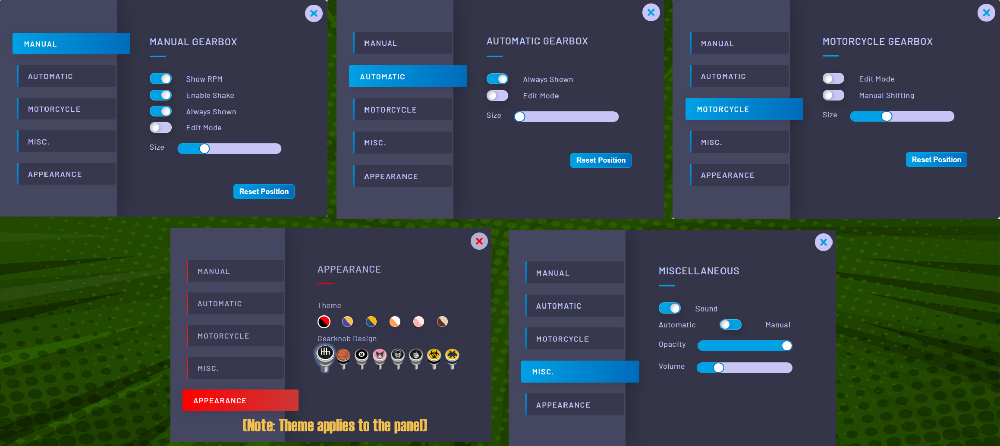
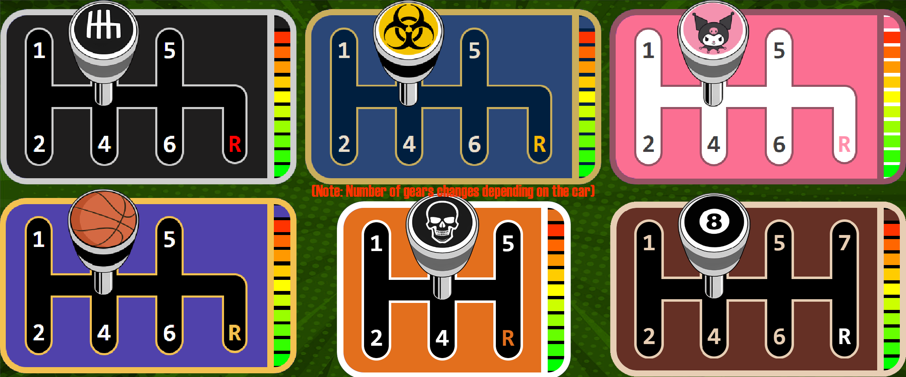
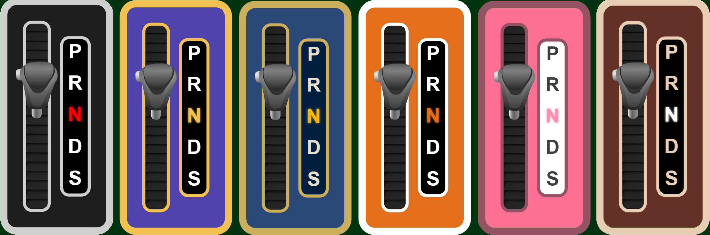
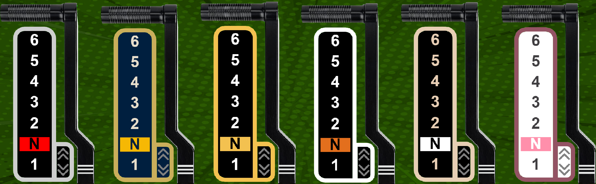

# FiveM Advanced Gearbox System

## Preview

<iframe width="1280" height="720"  src="https://www.youtube.com/embed/l6X9YEMYS8k" title="HG Hgearbox" frameborder="0" allow="picture-in-picture;" allowfullscreen></iframe>

## Description

Our script provides a significant enhancement to the in-game shifting experience. We've introduced three gearbox options: Manual, Auto, and Moto, and have made the user interface customizable. You can manipulate the gearboxes using your mouse or buttons, with a plethora of configuration options to tailor them to your preferences. It's all about elevating your gaming experience to the next level. All of this in a **STANDALONE** package
## Features
### Settings Panel
The settings panel enables players to fine-tune their gearboxes to their liking. We've designed an easy-to-use and intuitive user interface that allows you to adjust settings like position, size, and style for each gearbox. These screenshots display each tab within the panel:

Furthermore, we offer support for 12 languages that you can select from, and you even have the option to add your own language. You can also customize all the colors and knobs shown in the Appearance tab.

### Gearbox Types
#### Manual Gearbox
This option allows players to manually shift gears, giving them full control over their vehicle and creating a more realistic and challenging driving experience.

**Control Methods**
You can operate this gearbox using one of three different methods:
1. Mouse
      - After pressing the clutch button, a mouse cursor will appear directly above the gear knob, allowing you to move it into the desired gear.
2. Buttons
      - After pressing the clutch (which can be disabled in the configuration), you simply click the assigned number for the gear you want, and the gear knob will shift to that position.
3. Sequential Buttons
      - After pressing the clutch (again, this can be disabled in the configuration), you can click either the "Shift Up" or "Shift Down" button to select the next or previous gear respectively, causing the gear knob to move accordingly.
!!! note
    You can choose which of the three methods you want to allow in the config (You can pick more than 1).

**Themes Preview**

!!! note
    Gearbox themes and knobs can be customized individually.

#### Automatic Gearbox
This gearbox is designed for more casual players who prefer a simpler driving experience.

**Control Method**
This gearbox is exclusively controlled using the mouse. After pressing the action button, you can move the gear knob to one of the "PRNDS" positions.

**Themes Preview**

#### Motorcycle Gearbox
This gearbox is tailored for motorcycles.

**Control Methods**

1. Sequential
      - After pressing the clutch, you can either click the "Shift Up" or "Shift Down" button to shift up or down a gear.
2. Automatic Mode
      - More casual players can have the game shift gears automatically for them.

**Themes Preview**

### Gameplay & Physics
We've implemented some features that make the script more realistic, including:
- Engine revving without acceleration when the clutch is pressed or when in Neutral.
- Automatic rolling when the vehicle is in gear and the clutch is released.
- The vehicle stalls if you attempt to launch it in a high gear (applicable to Manual and Moto).
- When in reverse, you press the acceleration button to move instead of using the default brake button. 
!!! note 
    Most of these settings can be toggled in the configuration.
