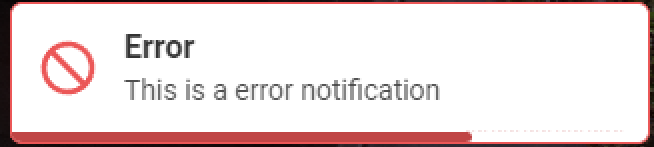
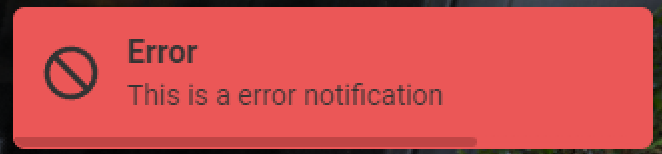
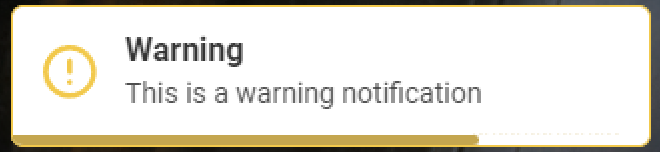

# FiveM Notification System

## Description

The standalone hg-notify system for FiveM enhances the in-game user experience by delivering real-time information to players through on-screen messages. It serves as a versatile tool for server administrators and script developers to communicate various events, updates, or alerts to the player base. The system is designed to be independent, providing a seamless integration into different scripts and scenarios.

## Preview

### Success Notification
{: width="40%"}
{: width="40%"}
### Error Notification
{: width="40%"}
{: width="40%"}
### Warning Notification
{: width="40%"}
{: width="40%"}
### Info Notification
{: width="40%"}
{: width="40%"}

## Features

- Open Source.
- Client/Server Sided exports.
- Highly customizable.
- Simple setup.
- Standalone.

### Usage

!!! tip
    Check [Developer Guide](../developer/)

