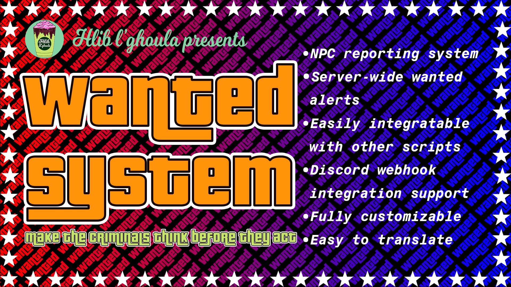
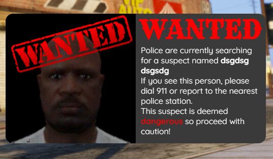
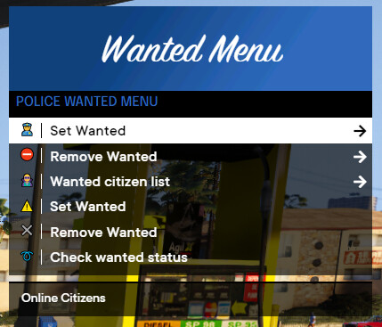

# FiveM Wanted System

## Preview

<iframe width="1280" height="720" src="https://www.youtube.com/embed/e6aMZKWifBo" title="HG Wanted" frameborder="0" allow="picture-in-picture;" allowfullscreen></iframe>

## Description

Tired of the rampant crime in your city? Frustrated with the incompetence of some police officers? Unable to move two blocks without falling victim to a robbery? Don't worry; this script will make criminals think twice before they act!

This is a wanted system based on ==**QBCORE**== by Hlib L’ghoula.

## Features

- Smart NPC reporting system.
- Server-wide wanted alerts with live player images.
- Easy integration with other scripts.
- Advanced discord log system.
- Fully customizable through script configuration and UI.
- Multilingual support.
- Simple setup.
- Highly optimized script.

### Interfaces

**Server-wide Wanted Alerts**:

!!! note
    This fully customizable notification can be issued by police officers whenever needed.

**Menu**:

??? note
    This menu utilizes [MenuV](https://github.com/ThymonA/menuv){:target="_blank"}.
